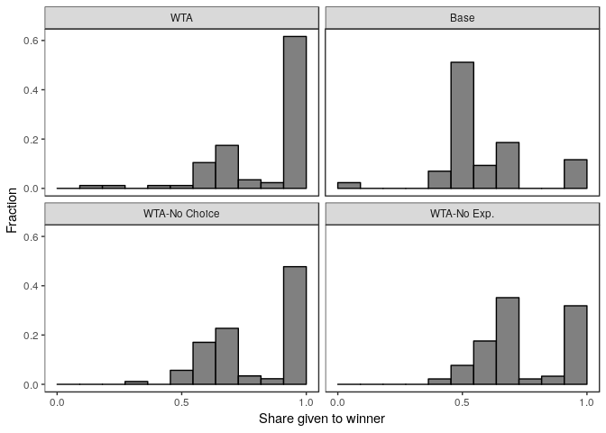
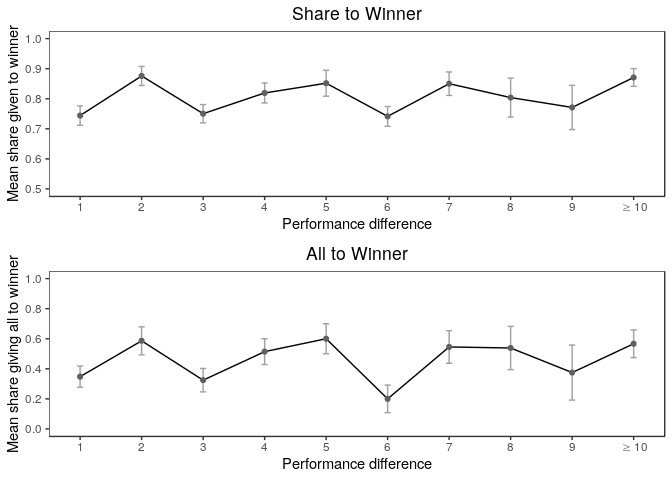
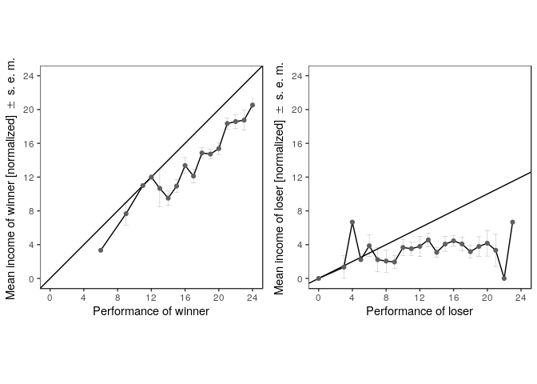
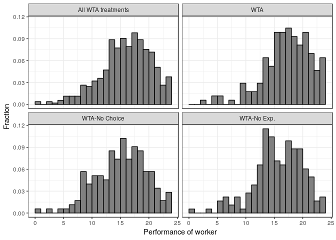
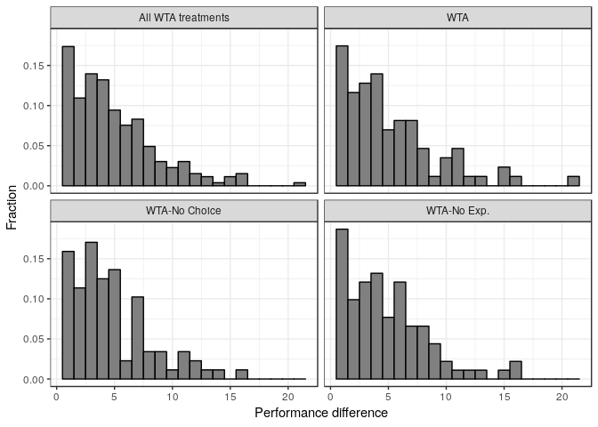
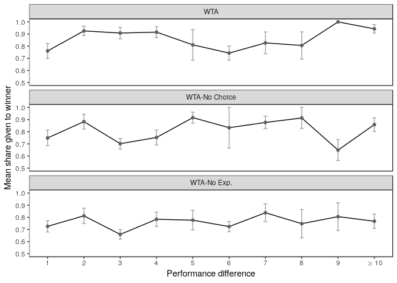
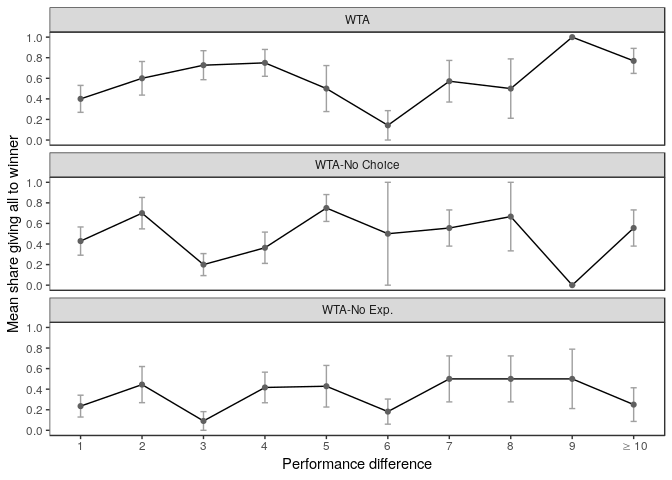

Fairness in Winner-Take-All Markets: replication package
================
Christian Braathen and Erik O. Sorensen.
30 september, 2018

The code in this file is developed in parallell with the code used to estimate the results in the paper, and also by a different team in order to ensure that reported analysis and estimation code matches up.

Reading data and initial data transformations.
==============================================

Reading inn data from file.

``` r
df_data <- read.csv("data/mmwinner.csv",sep=",")
```

First, make the factor with treatments with names that correspond to those in the paper

``` r
df_data$T <- as.factor(df_data$T)
levels(df_data$T) <- c("WTA-No Choice",
                       "WTA",
                       "WTA-No Exp.",
                       "Base")
```

Some transformations that are useful for producing the graphs.

``` r
data_no_ties  <- df_data %>% mutate( shareWinner = 1 - shareX,
                                     allWinner = (e2==y2),
                                     difference = abs(x1-x2),
                                     performance_winner = x2,
                                     performance_loser = x1,
                                     normalized_income_winner = y2/0.15,
                                     normalized_income_loser  = y1/0.15,
                                     difference_trimmed = ifelse(difference>10,10,difference),
                                     cright = political>=4,
                                     female = (sex==2)) %>%
  filter(e1==0) 
```

Figure 1
========

Figure 1 plots a histogram of the share given to the winner. We plot in 1/11 wide bins so that the center bin is centered at 1/2.

We want to reorder the treatments for this purpose. 

Figure 2
========

Figure 2 plots the share to winner and the mean share giving all to the winner by the winning margin. First, summarizing the data to plotted. Note that the top we are summarizing by a trimmed difference.

First the share given to the winner:

``` r
plot_shareToWinner_pooled <- data_no_ties_figure_2 %>% 
  ggplot(aes(x = difference_trimmed, y = mean_shareWinner)) +
  geom_errorbar(aes(ymin=mean_shareWinner - se_shareWinner, 
                    ymax=mean_shareWinner + se_shareWinner),
                colour="#A0A0A0", width=0.1) +
  geom_line() +
  geom_point(colour="#606060") +
  scale_x_continuous(name="Performance difference",
                     breaks = round(seq(min(data_no_ties_figure_2$difference_trimmed), 
                                        max(data_no_ties_figure_2$difference_trimmed), 
                                        by = 1),0),
                     labels=c(1:9,TeX('$\\geq 10$'))) +
  scale_y_continuous(name="Mean share given to winner",
                     breaks = seq(0.5, 1, by = 0.1),
                     limits = c(0.5,1)) +
  theme_bw() +
  ggtitle("Share to Winner") +
  theme(panel.grid.major = element_blank(),
        panel.grid.minor = element_blank(),
        plot.title = element_text(hjust = 0.5))
```

Now, similar, but for the share that gives everything to the winner:

Now for putting these two panels together:



Figure 3
========

In figure 3, we want to plot mean incomes of winner against winner performance and mean income of loser against the performance of the loser, with lines for indicating the hypotheses of factual merit (left) and counterfactual merit (right).

First, preparing the data

Now, we want to plot the left hand side figure

``` r
plot_income_winner <- F3L %>% 
  ggplot(aes(x=performance_winner, y=mean_y)) + 
  geom_errorbar(aes(ymin=mean_y-se_y, ymax=mean_y +se_y),
                colour="#808080", 
                width=0.6,
                size=0.1) +
  geom_line() +
  geom_abline(aes(intercept=0,slope=1)) +
  geom_point(colour="#606060") +
  scale_x_continuous(name="Performance of winner",
                     breaks = seq(0, 24, by = 4),
                     limits=c(0,24)) +
  scale_y_continuous(name=TeX('Mean income of winner \\[normalized\\] $\\pm$ s.e.m.'),
                     breaks = seq(0, 24, by = 4),
                     limits=c(0,24)) +
  theme_bw() +
  theme(panel.grid.major = element_blank(), 
        panel.grid.minor = element_blank(),
        plot.title = element_text(hjust = 0.5)) +
  theme(aspect.ratio=1)
```

The right hand side in similar way:

``` r
plot_income_loser <- F3R %>% 
  ggplot(aes(x=performance_loser, y=mean_y)) + 
  geom_errorbar(aes(ymin=mean_y-se_y, ymax=mean_y+se_y),
                colour="#808080", 
                width=0.6,
                size=0.1) +
  geom_line() +
  geom_abline(aes(intercept=0,slope=0.5)) +
  geom_point(colour="#606060") +
  scale_x_continuous(name="Performance of loser",
                     breaks = seq(0, 24, by = 4),
                     limits=c(0,24)) +
  scale_y_continuous(name=TeX('Mean income of loser \\[normalized\\] $\\pm$ s.e.m.'),
                     breaks = seq(0, 24, by = 4),
                     limits=c(0,24)) +
  theme_bw() +
  theme(panel.grid.major = element_blank(), 
        panel.grid.minor = element_blank(),
        plot.title = element_text(hjust = 0.5)) +
  theme(aspect.ratio=1)
```

Now putting them together in a single plot



Regression tables
=================

Regression results: Treatment effects (Table 2)
-----------------------------------------------

The regression table in the main text looks at treatment effects on the share to the winner and the share that gives all to the winner. I create the treatment dummies explicitly to control the names in the regression output.

``` r
dR1 <- data_no_ties %>%
  mutate(wta = T=="WTA",
         wtanc = T=="WTA-No Choice",
         wtane = T=="WTA-No Exp.")
lmR1_1 <- lm(shareWinner ~ wta + wtanc + wtane, data = dR1)
vR1_1 <- cluster.vcov(lmR1_1, 1:nrow(dR1))
lmR1_2 <- lm(shareWinner ~ wta + wtanc + wtane + age + female + cright + I(sessionid), 
             data = dR1)
vR1_2 <- cluster.vcov(lmR1_2, 1:nrow(dR1))
lmR1_3 <- lm(allWinner ~ wta + wtanc + wtane , data = dR1)
vR1_3 <- cluster.vcov(lmR1_3, 1:nrow(dR1))
lmR1_4 <- lm(allWinner ~ wta + wtanc + wtane + age + female + cright + I(sessionid), 
             data = dR1)
vR1_4 <- cluster.vcov(lmR1_4, 1:nrow(dR1))
```

Calculation of some ancillary output.

``` r
# First, dependent mean in Base:
m1 <- sprintf("%4.3f", mean(dR1$shareWinner[dR1$T=="Base"]))
m2 <- sprintf("%4.3f", mean(dR1$allWinner[dR1$T=="Base"]))
R1_means <- c("Dependent mean (base):", m1,m1,m2,m2)
# Three rows of Linear hypothesis tests
p1 <- c("P: WTA = WTA-No choice",
        sprintf("%4.3f", summary(glht(lmR1_1, linfct=c("wtaTRUE - wtancTRUE = 0"),
                                     vcov=vR1_1))$test$pvalues[1]),
        sprintf("%4.3f", summary(glht(lmR1_2, linfct=c("wtaTRUE - wtancTRUE = 0"),
                                      vcov=vR1_2))$test$pvalues[1]),
        sprintf("%4.3f", summary(glht(lmR1_3, linfct=c("wtaTRUE - wtancTRUE = 0"),
                                      vcov=vR1_3))$test$pvalues[1]),
        sprintf("%4.3f", summary(glht(lmR1_4, linfct=c("wtaTRUE - wtancTRUE = 0"),
                                      vcov=vR1_4))$test$pvalues[1]))
p2 <- c("P: WTA = WTA-No Exp.",
        sprintf("%4.3f", summary(glht(lmR1_1, linfct=c("wtaTRUE - wtaneTRUE = 0"),
                                     vcov=vR1_1))$test$pvalues[1]),
        sprintf("%4.3f", summary(glht(lmR1_2, linfct=c("wtaTRUE - wtaneTRUE = 0"),
                                      vcov=vR1_2))$test$pvalues[1]),
        sprintf("%4.3f", summary(glht(lmR1_3, linfct=c("wtaTRUE - wtaneTRUE = 0"),
                                      vcov=vR1_3))$test$pvalues[1]),
        sprintf("%4.3f", summary(glht(lmR1_4, linfct=c("wtaTRUE - wtaneTRUE = 0"),
                                      vcov=vR1_4))$test$pvalues[1]))
p3 <- c("P: WTA No choice = WTA-No Exp.",
        sprintf("%4.3f", summary(glht(lmR1_1, linfct=c("wtaneTRUE - wtancTRUE = 0"),
                                     vcov=vR1_1))$test$pvalues[1]),
        sprintf("%4.3f", summary(glht(lmR1_2, linfct=c("wtaneTRUE - wtancTRUE = 0"),
                                      vcov=vR1_2))$test$pvalues[1]),
        sprintf("%4.3f", summary(glht(lmR1_3, linfct=c("wtaneTRUE - wtancTRUE = 0"),
                                      vcov=vR1_3))$test$pvalues[1]),
        sprintf("%4.3f", summary(glht(lmR1_4, linfct=c("wtaneTRUE - wtancTRUE = 0"),
                                      vcov=vR1_4))$test$pvalues[1]))
```

Output of regressions into table

``` r
stargazer( lmR1_1, lmR1_2, lmR1_3, lmR1_4,
           se =list(sqrt(diag(vR1_1)), sqrt(diag(vR1_2)), 
                    sqrt(diag(vR1_3)), sqrt(diag(vR1_4))),
           type="text", 
           column.labels=c("Share to winner", "All to winner"),
           column.separate=c(2,2),
           df=FALSE, 
           omit = c("I(sessionid)*"),
           keep.stat=c("adj.rsq", "n"),
           add.lines = list(c("Session FE","no","yes","no","yes"),
                              R1_means, p1, p2, p3)
)
```

    ## 
    ## ==================================================================
    ##                                        Dependent variable:        
    ##                                -----------------------------------
    ##                                   shareWinner        allWinner    
    ##                                 Share to winner    All to winner  
    ##                                  (1)      (2)      (3)      (4)   
    ## ------------------------------------------------------------------
    ## wta                            0.273*** 0.275*** 0.465*** 0.472***
    ##                                (0.036)  (0.037)  (0.073)  (0.075) 
    ##                                                                   
    ## wtanc                          0.221*** 0.223*** 0.361*** 0.367***
    ##                                (0.036)  (0.036)  (0.073)  (0.074) 
    ##                                                                   
    ## wtane                          0.166*** 0.170*** 0.202*** 0.216***
    ##                                (0.035)  (0.036)  (0.070)  (0.073) 
    ##                                                                   
    ## age                                      0.001             -0.001 
    ##                                         (0.005)           (0.013) 
    ##                                                                   
    ## female                                   -0.019            -0.035 
    ##                                         (0.023)           (0.057) 
    ##                                                                   
    ## cright                                   0.008             0.024  
    ##                                         (0.023)           (0.057) 
    ##                                                                   
    ## Constant                       0.587*** 0.594*** 0.116**   0.158  
    ##                                (0.029)  (0.127)  (0.049)  (0.313) 
    ##                                                                   
    ## ------------------------------------------------------------------
    ## Session FE                        no      yes       no      yes   
    ## Dependent mean (base):          0.587    0.587    0.116    0.116  
    ## P: WTA = WTA-No choice          0.079    0.087    0.170    0.177  
    ## P: WTA = WTA-No Exp.            0.000    0.001    0.000    0.001  
    ## P: WTA No choice = WTA-No Exp.  0.060    0.078    0.030    0.044  
    ## Observations                     308      308      308      308   
    ## Adjusted R2                     0.160    0.149    0.090    0.076  
    ## ==================================================================
    ## Note:                                  *p<0.1; **p<0.05; ***p<0.01

Regression results: Counterfactual vs Factual merit (Table A.2)
---------------------------------------------------------------

``` r
dRA2 <- data_no_ties %>% filter(T!="Base") %>%
  rename( performance_winner = x2, performance_loser = x1)
lmRA2_1 <- lm(normalized_income_winner ~ performance_winner, data = dRA2)
vRA2_1 <- cluster.vcov(lmRA2_1, 1:nrow(dRA2))
lmRA2_2 <- lm(normalized_income_winner ~ performance_winner + 
                age + female + cright + I(sessionid), data = dRA2)
vRA2_2 <- cluster.vcov(lmRA2_2, 1:nrow(dRA2))
lmRA2_3 <- lm(normalized_income_loser ~ performance_loser, data = dRA2)
vRA2_3 <- cluster.vcov(lmRA2_3, 1:nrow(dRA2))
lmRA2_4 <- lm(normalized_income_loser  ~ performance_loser + 
                age + female + cright + I(sessionid), data = dRA2)
vRA2_4 <- cluster.vcov(lmRA2_4, 1:nrow(dRA2))
```

Some ancillary tests are needed:

``` r
pA2_1<- c("P: Performance winner = 1", 
        sprintf("%4.3f", summary(glht(lmRA2_1, linfct=c("performance_winner = 1"),
                                     vcov=vRA2_1))$test$pvalues[1]),
        sprintf("%4.3f", summary(glht(lmRA2_2, linfct=c("performance_winner = 1"),
                                     vcov=vRA2_2))$test$pvalues[1]),
        " ", " ")

pA2_2<- c("P: Performance loser = 0.5", " ", " ",
        sprintf("%4.3f", summary(glht(lmRA2_3, linfct=c("performance_loser = 0.5"),
                                     vcov=vRA2_3))$test$pvalues[1]),
        sprintf("%4.3f", summary(glht(lmRA2_4, linfct=c("performance_loser = 0.5"),
                                     vcov=vRA2_4))$test$pvalues[1]))
```

Output of regressions into table

``` r
stargazer( lmRA2_1, lmRA2_2, lmRA2_3, lmRA2_4,
           se =list(sqrt(diag(vRA2_1)), sqrt(diag(vRA2_2)), sqrt(diag(vRA2_3)), sqrt(diag(vRA2_4))),
           type="text",
           column.labels = c("Income to winner", "Income to loser"),
           column.separate=c(2,2),
           df=FALSE, 
           order=c("performance_winner", "performance_loser"),
           keep.stat=c("adj.rsq", "n"),
           omit = c("I(sessionid)*"),
          add.lines=list(c("Session FE", "no", "yes", "no", "yes"),
                         pA2_1, pA2_2))
```

    ## 
    ## ========================================================================
    ##                                         Dependent variable:             
    ##                            ---------------------------------------------
    ##                             normalized_income_winner   normalized_income_loser
    ##                                 Income to winner        Income to loser 
    ##                                (1)           (2)          (3)      (4)  
    ## ------------------------------------------------------------------------
    ## performance_winner           0.939***      0.938***                     
    ##                              (0.066)       (0.068)                      
    ##                                                                         
    ## performance_loser                                       0.100*   0.088* 
    ##                                                         (0.052)  (0.051)
    ##                                                                         
    ## age                                         0.126                -0.118 
    ##                                            (0.114)               (0.112)
    ##                                                                         
    ## female                                      -0.537                0.504 
    ##                                            (0.484)               (0.475)
    ##                                                                         
    ## cright                                      -0.129                0.124 
    ##                                            (0.474)               (0.471)
    ##                                                                         
    ## Constant                     -2.446**      -5.114*     2.204***  4.839* 
    ##                              (1.238)       (3.093)      (0.718)  (2.816)
    ##                                                                         
    ## ------------------------------------------------------------------------
    ## Session FE                      no           yes          no       yes  
    ## P: Performance winner = 1     0.359         0.362                       
    ## P: Performance loser = 0.5                               0.000    0.000 
    ## Observations                   265           265          265      265  
    ## Adjusted R2                   0.403         0.403        0.008    0.005 
    ## ========================================================================
    ## Note:                                        *p<0.1; **p<0.05; ***p<0.01

Further appendix material
=========================

Randomization into treatments
-----------------------------

First the summaries of data:

``` r
data_no_ties %>% group_by(T) %>%
  summarize(mean_age = mean(age),
            mean_female = mean(female),
            mean_right = mean(cright))
```

    ## # A tibble: 4 x 4
    ##   T             mean_age mean_female mean_right
    ##   <fct>            <dbl>       <dbl>      <dbl>
    ## 1 WTA-No Choice     22.1       0.489      0.568
    ## 2 WTA               22.2       0.372      0.558
    ## 3 WTA-No Exp.       21.7       0.429      0.637
    ## 4 Base              21.8       0.326      0.628

``` r
data_no_ties %>% summarize(mean_age = mean(age),
            mean_female = mean(female),
            mean_right = mean(cright))
```

    ##   mean_age mean_female mean_right
    ## 1  21.9753   0.4155844  0.5941558

Now, Anova and chi square tests by variable as relevant:

``` r
summary(aov(age ~ T, data = data_no_ties))
```

    ##              Df Sum Sq Mean Sq F value Pr(>F)
    ## T             3   13.6   4.521   1.049  0.371
    ## Residuals   304 1310.1   4.310

``` r
chisq.test(table(data_no_ties$female, data_no_ties$T))
```

    ## 
    ##  Pearson's Chi-squared test
    ## 
    ## data:  table(data_no_ties$female, data_no_ties$T)
    ## X-squared = 4.1007, df = 3, p-value = 0.2508

``` r
chisq.test(table(data_no_ties$cright, data_no_ties$T))
```

    ## 
    ##  Pearson's Chi-squared test
    ## 
    ## data:  table(data_no_ties$cright, data_no_ties$T)
    ## X-squared = 1.6165, df = 3, p-value = 0.6557

Histogram of performance by treatment (Figure A.1)
--------------------------------------------------

For the histogram of performance, it is easiest to add a an "All" group and then produce the 4-panel graph with ggplot's facet feature.

``` r
data_no_ties %>% 
  filter(T!="Base") %>%
  mutate(T = factor("All WTA treatments")) %>% 
  bind_rows(data_no_ties) %>%
  filter(T!="Base") %>%
  mutate(treatment = factor(T, levels=c("All WTA treatments",
                                        "WTA", 
                                        "WTA-No Choice",
                                        "WTA-No Exp."))) %>%
  gather(status, x, x1:x2) %>%
  ggplot(aes(x=x, y= (..count..)/tapply(..count..,..PANEL..,sum)[..PANEL..])) +
    geom_histogram(binwidth=1, boundary=0, colour="black",fill="#808080") + 
    theme_bw() + facet_wrap(~treatment) + ylab("Fraction") + xlab("Performance of worker")
```

    ## Warning in bind_rows_(x, .id): Unequal factor levels: coercing to character

    ## Warning in bind_rows_(x, .id): binding character and factor vector,
    ## coercing into character vector

    ## Warning in bind_rows_(x, .id): binding character and factor vector,
    ## coercing into character vector



Histogram of performance difference by treatment (Figure A.2)
-------------------------------------------------------------

Almost same procedure as above

``` r
data_no_ties %>% 
  filter(T!="Base") %>%
  mutate(T = factor("All WTA treatments")) %>% 
  bind_rows(data_no_ties) %>%
  filter(T!="Base") %>%
  mutate(treatment = factor(T, levels=c("All WTA treatments",
                                        "WTA", 
                                        "WTA-No Choice",
                                        "WTA-No Exp.")),
         performance_difference = abs(x2-x1))  %>%
  ggplot(aes(x = performance_difference, 
             y = (..count..)/tapply(..count..,..PANEL..,sum)[..PANEL..] )) +
    geom_histogram(binwidth=1, colour="black",fill="#808080") +
    theme_bw() + facet_wrap(~treatment) + ylab("Fraction") + xlab("Performance difference")
```

    ## Warning in bind_rows_(x, .id): Unequal factor levels: coercing to character

    ## Warning in bind_rows_(x, .id): binding character and factor vector,
    ## coercing into character vector

    ## Warning in bind_rows_(x, .id): binding character and factor vector,
    ## coercing into character vector



The winning margin by treatment
-------------------------------

First, creating data

``` r
data_no_ties_figure_A3_A4 <- data_no_ties %>%
  filter(T!="Base") %>%
  group_by(T, difference_trimmed) %>%
  summarize( mean_shareWinner = mean(shareWinner),
             se_shareWinner = sd(shareWinner)/sqrt(n()),
             mean_allWinner = mean( y2==e2),
             se_allWinner = sd( y2==e2)/sqrt(n())) %>%
  mutate( treatment = fct_relevel(T, c("WTA", "WTA-No Choice", "WTA-No Exp.")))
```

### Figure A3:

``` r
data_no_ties_figure_A3_A4 %>% 
  ggplot(aes(x = difference_trimmed, y = mean_shareWinner)) +
  geom_errorbar(aes(ymin=mean_shareWinner - se_shareWinner, 
                    ymax=mean_shareWinner + se_shareWinner),
                colour="#A0A0A0", width=0.1) +
  geom_line() +
  geom_point(colour="#606060") +
  scale_x_continuous(name="Performance difference",
                     breaks = round(seq(min(data_no_ties_figure_A3_A4$difference_trimmed), 
                                        max(data_no_ties_figure_A3_A4$difference_trimmed), 
                                        by = 1),0),
                     labels=c(1:9,TeX('$\\geq 10$'))) +
  scale_y_continuous(name="Mean share given to winner",
                     breaks = seq(0.5, 1, by = 0.1),
                     limits = c(0.5,1)) +
  theme_bw() +
  theme(panel.grid.major = element_blank(),
        panel.grid.minor = element_blank(),
        plot.title = element_text(hjust = 0.5)) + facet_wrap(~treatment, ncol=1)
```

    ## Warning: Removed 1 rows containing missing values (geom_errorbar).



### Figure A4:

``` r
data_no_ties_figure_A3_A4 %>% 
  ggplot(aes(x = difference_trimmed, y = mean_allWinner)) +
  geom_errorbar(aes(ymin=mean_allWinner - se_allWinner, 
                    ymax=mean_allWinner + se_allWinner),
                colour="#A0A0A0", width=0.1) +
  geom_line() +
  geom_point(colour="#606060") +
  scale_x_continuous(name="Performance difference",
                     breaks = round(seq(min(data_no_ties_figure_A3_A4$difference_trimmed), 
                                        max(data_no_ties_figure_A3_A4$difference_trimmed), 
                                        by = 1),0),
                     labels=c(1:9,TeX('$\\geq 10$'))) +
  scale_y_continuous(name="Mean share giving all to winner",
                     breaks = seq(0.0, 1, by = 0.2),
                     limits = c(0.0,1)) +
  theme_bw() +
  theme(panel.grid.major = element_blank(),
        panel.grid.minor = element_blank(),
        plot.title = element_text(hjust = 0.5)) + facet_wrap(~treatment, ncol=1)
```

    ## Warning: Removed 1 rows containing missing values (geom_errorbar).



Versions of packages used
=========================

``` r
sessionInfo()
```

    ## R version 3.5.1 (2018-07-02)
    ## Platform: x86_64-pc-linux-gnu (64-bit)
    ## Running under: Ubuntu 18.04.1 LTS
    ## 
    ## Matrix products: default
    ## BLAS: /usr/lib/x86_64-linux-gnu/blas/libblas.so.3.7.1
    ## LAPACK: /usr/lib/x86_64-linux-gnu/lapack/liblapack.so.3.7.1
    ## 
    ## locale:
    ##  [1] LC_CTYPE=en_US.UTF-8       LC_NUMERIC=C              
    ##  [3] LC_TIME=nb_NO.UTF-8        LC_COLLATE=en_US.UTF-8    
    ##  [5] LC_MONETARY=nb_NO.UTF-8    LC_MESSAGES=en_US.UTF-8   
    ##  [7] LC_PAPER=nb_NO.UTF-8       LC_NAME=C                 
    ##  [9] LC_ADDRESS=C               LC_TELEPHONE=C            
    ## [11] LC_MEASUREMENT=nb_NO.UTF-8 LC_IDENTIFICATION=C       
    ## 
    ## attached base packages:
    ## [1] stats     graphics  grDevices utils     datasets  methods   base     
    ## 
    ## other attached packages:
    ##  [1] bindrcpp_0.2.2     multiwayvcov_1.2.3 stargazer_5.2.2   
    ##  [4] cowplot_0.9.3      latex2exp_0.4.0    forcats_0.3.0     
    ##  [7] stringr_1.3.1      dplyr_0.7.6        purrr_0.2.5       
    ## [10] readr_1.1.1        tidyr_0.8.1        tibble_1.4.2      
    ## [13] ggplot2_3.0.0      tidyverse_1.2.1    multcomp_1.4-8    
    ## [16] TH.data_1.0-9      MASS_7.3-50        survival_2.42-6   
    ## [19] mvtnorm_1.0-8     
    ## 
    ## loaded via a namespace (and not attached):
    ##  [1] Rcpp_0.12.18     lubridate_1.7.4  lattice_0.20-35  zoo_1.8-4       
    ##  [5] utf8_1.1.4       assertthat_0.2.0 rprojroot_1.3-2  digest_0.6.17   
    ##  [9] R6_2.2.2         cellranger_1.1.0 plyr_1.8.4       backports_1.1.2 
    ## [13] evaluate_0.11    httr_1.3.1       pillar_1.3.0     rlang_0.2.2     
    ## [17] lazyeval_0.2.1   readxl_1.1.0     rstudioapi_0.7   Matrix_1.2-14   
    ## [21] rmarkdown_1.10   labeling_0.3     splines_3.5.1    munsell_0.5.0   
    ## [25] broom_0.5.0      compiler_3.5.1   modelr_0.1.2     pkgconfig_2.0.2 
    ## [29] htmltools_0.3.6  tidyselect_0.2.4 codetools_0.2-15 fansi_0.3.0     
    ## [33] crayon_1.3.4     withr_2.1.2      grid_3.5.1       nlme_3.1-137    
    ## [37] jsonlite_1.5     gtable_0.2.0     magrittr_1.5     scales_1.0.0    
    ## [41] cli_1.0.0        stringi_1.2.4    xml2_1.2.0       boot_1.3-20     
    ## [45] sandwich_2.5-0   tools_3.5.1      glue_1.3.0       hms_0.4.2       
    ## [49] parallel_3.5.1   yaml_2.2.0       colorspace_1.3-2 rvest_0.3.2     
    ## [53] knitr_1.20       bindr_0.1.1      haven_1.1.2
